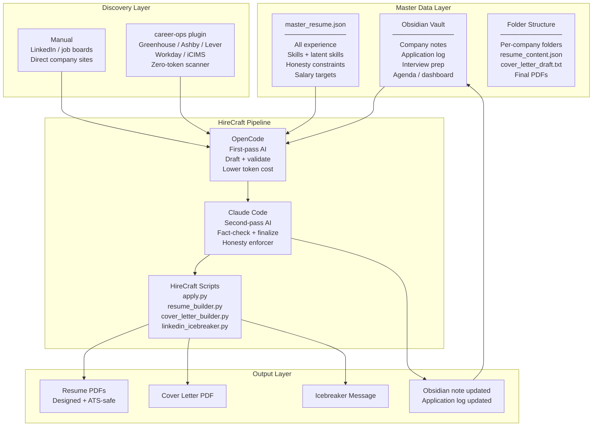
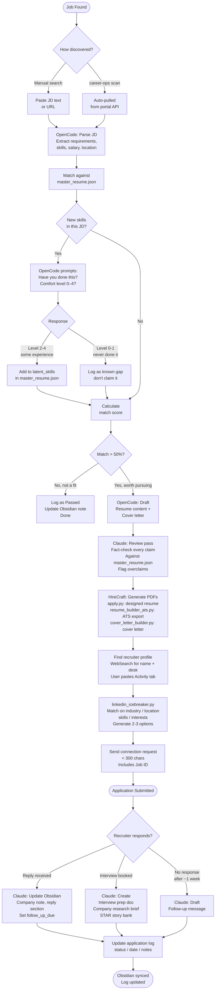
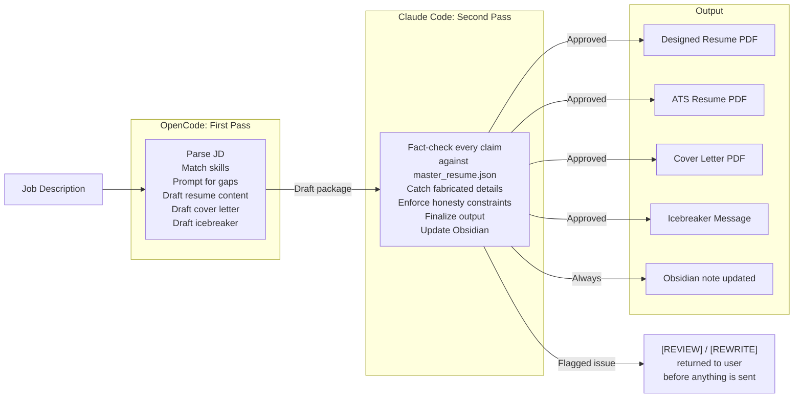

# HireCraft Workflow

Three diagrams covering the full system: architecture, pipeline, and AI stack.

---

## 1. System Architecture

How everything connects. Obsidian and the folder structure are the source of truth. Everything else reads from or writes back to them.

---

## 2. Job Processing Pipeline

The step-by-step flow from job found to application sent and tracked.

---

## 3. AI Token Stack

OpenCode handles the expensive first-pass work. Claude catches what needs a second set of eyes. Keeps costs down without sacrificing accuracy.

---

## Why This Stack

| Concern | How it's handled |
|---|---|
| Token cost | OpenCode does the heavy first-pass draft work |
| Accuracy | Claude fact-checks every claim against master_resume.json |
| Honesty | Honesty constraints in master_resume.json are enforced on every Claude pass |
| Nothing fabricated | Named entities must trace to master or get cut |
| Nothing sent without review | [REVIEW] flags stop the pipeline before submission |
| Application tracking | Every state change updates Obsidian in the same turn |
